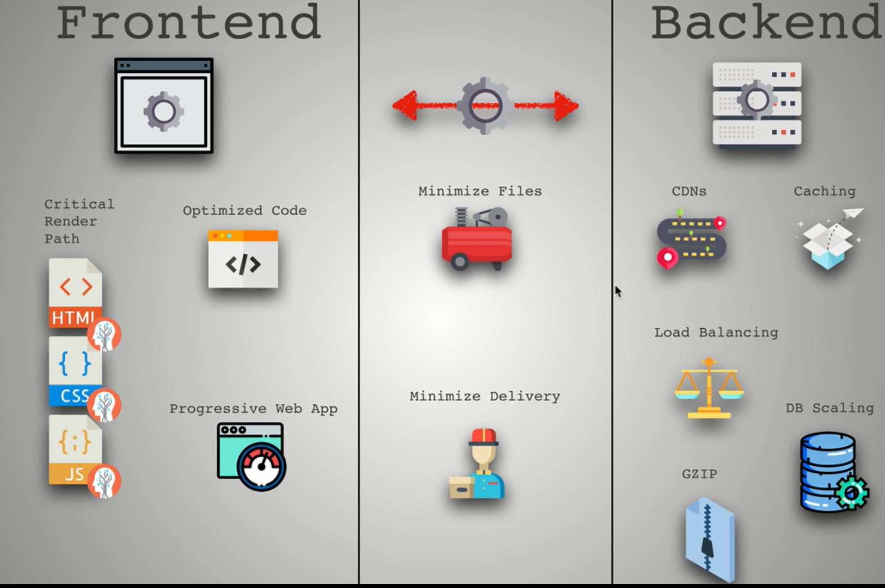
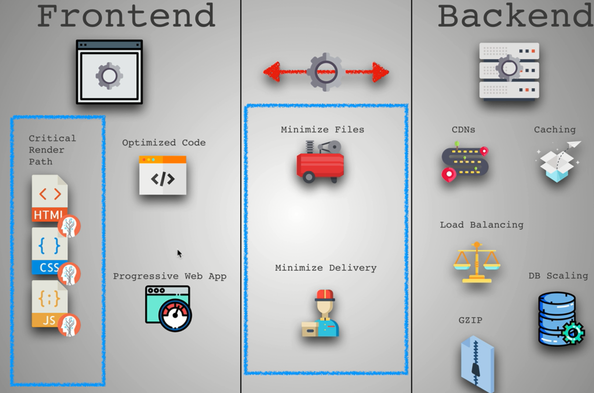
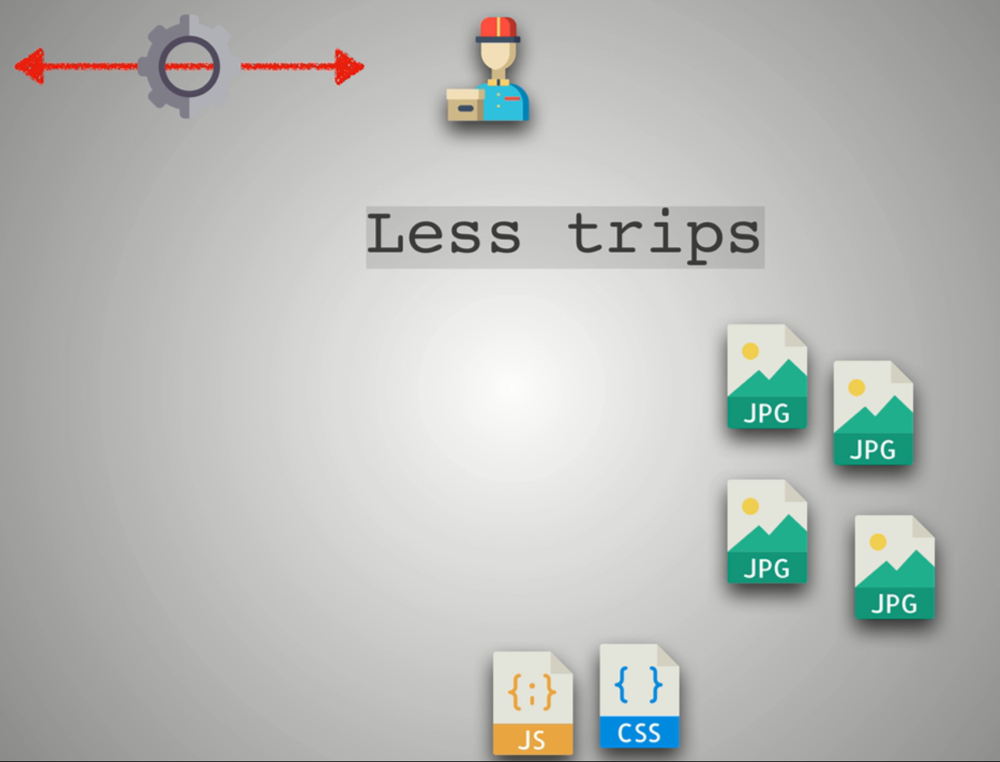
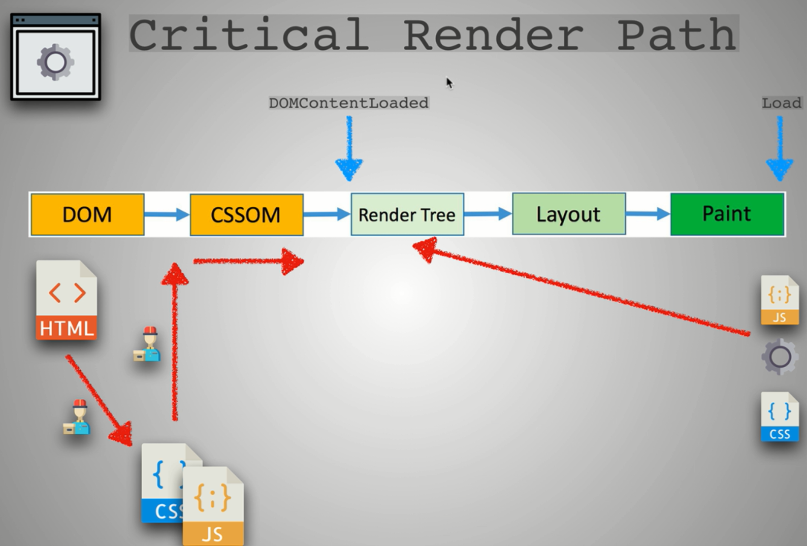
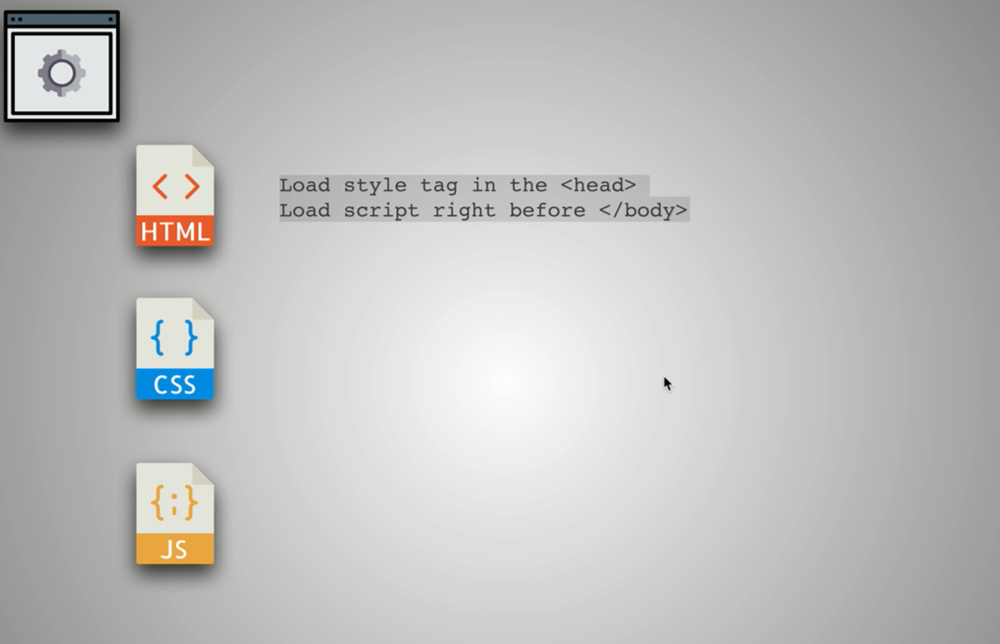
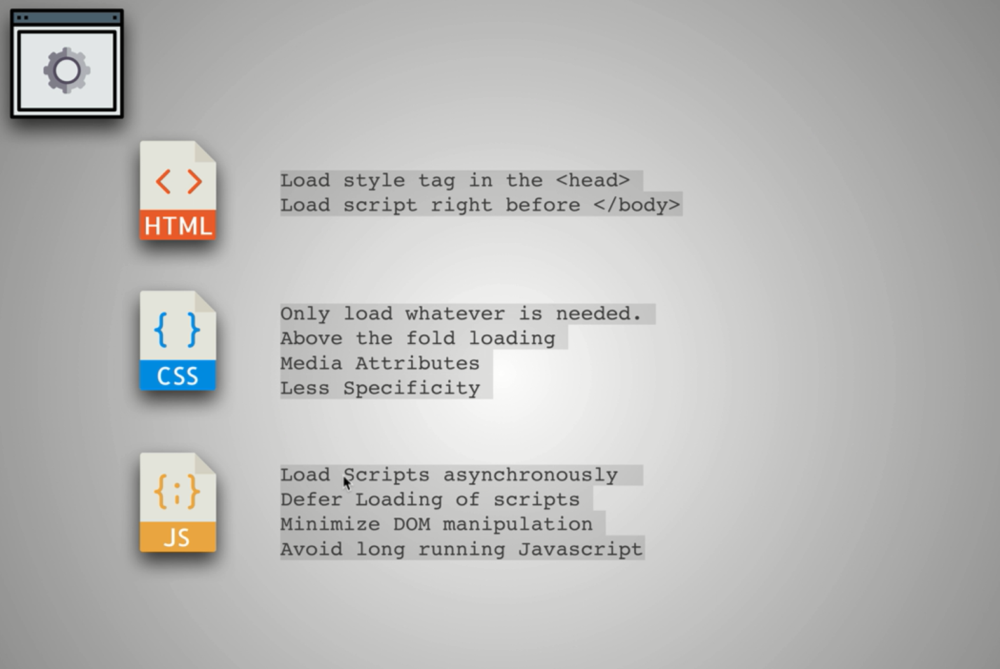

# Performance











## Lets go over the Critical Render path one by one

### Step one



### Step 2 and 3



here is a example of on loading css files that doesn't need to be loaded.

```html
<!DOCTYPE html>
<html lang="en">

<head>
    <meta charset="UTF-8">
    <meta name="viewport" content="width=device-width, initial-scale=1.0">
    <title>Document</title>
    <link rel="stylesheet" href="./style.css">
    <link rel="stylesheet" href="./style2.css">
    <!-- <link rel="stylesheet" href="./style3.css"> -->
</head>

<body>
    <h1>How Fast?</h1>
    <button>Click Me</button>

    <h1 class="important">This is important above the fold</h1>
    <h1 class="secondary">This is not important . you won't see this until page loads</h1>
    <script>
        const loadStyleSheet = src => {
            if (document.createStylesheet) {
                document.createStylesheet(src)
            } else {
                const styleSheet = document.createElement('link')
                styleSheet.href = src;
                styleSheet.rel = 'stylesheet'
                document.getElementsByTagName('head')[0].appendChild(styleSheet)
            }
        }

        window.onload = function () {
            console.log('window is loading');
            loadStyleSheet("./style3.css")

        }
    </script>
</body>

</html>

```

```css

h1{
color: green;
}


```

```css

.important{
    background-color: yellow;
}

```

```css

.secondary{
    background-color:tomato;
}

```

